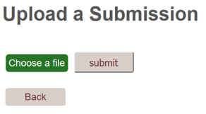
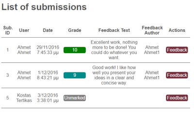
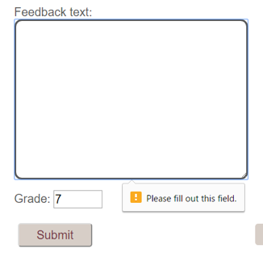

# WebDV – ASP.NET MVC project

## Introduction
This project demonstrates the usage of ASP.NET MVC platform in a simple system that provides ability for students to upload their work and for the lecturers to mark their work. Along ASP.NET, the Razor rendering engine, and SQL Server for database storage were used too. Code First Entity Framework was used to define models that are talking with the database. Everything is coded in Visual Studio IDE, GitHub was used for versioning and collaboration and the custom CSS handles the layout. 


Figure 1


Figure 2

The structure of the app is shown on Figure 1 with the file tree on Figure 2. We have three **controllers**, HomeController, that manages the home page and depending on the role of the user logged in, shows the corresponding actions. Submission and Feedback controllers handle their respective tasks. **Models** defined include the models generated by the ASP.NET Identity framework, as well as Submission model, shown on Figure 3, which stores the data about submissions.  After the controller gets the data from the models, it passes them to the corresponding **views**. We have defined several views, for home, submission and feedback controllers respectively.  The partial views were used as well, in a form of _Layout.cshtml and _PartialLayout.cshtml, so the common elements that are present on every page are reused.  Sample of the Index.cshtml view, used in HomeController.cs can be seen on Figure 4.


Figure 3


Figure 4

## Database
SQL Server was used for the database, and Entity Framework Code First were used to bridge the code and the SQL tables, nothing was done directly in the database. The database structure is on Figure 5.


Figure 5

## Authentication


Authentication was provided by the ASP.NET identity framework. We used individual user accounts, as well as role based authentication, so depending on the role, user can only do actions defined for their role: submit and view their own submissions if they are in the “Student” role, or view everything and provide feedback and mark on submissions if they are in role “Lecturer”. The roles are created automatically if they are not present, from the Startup.cs file. New users get “Student” role assigned by default.


## Testing
To test the application, we went through both roles to test the business logic. Upon opening the application, user must log in.


### Student


Figure 6
As soon as we log in as a student, we are presented with the home page, Figure 6, which lists all the submissions that this current student has made in the system (no student can see other submissions). He can create a new submission, Figure 7, by uploading a new file, and can also view his previous submissions, with grade and feedback if provided. When a student is finished, he can easily log off from the button in the navigation bar, and he is then redirected to the log in page. 



Figure 7

### Lecturer
Lecturer can view all of the submissions listed, and for each particular submission the lecturer can see the submitted contents and provide or update the grade and the feedback. This is shown on Figures 8 and 9. In addition, if we have an error in the feedback submission (validation is explained below), the feedback text and grade are not lost, but they are kept in the text fields, the code that handles this is shown on Figure 10. 



Figure 8


Figure 9


Figure 10

## Validation
For the validation of our web application, we used both client side validation, and server side validation. When the user tried to input invalid fields or files, the appropriate errors were shown. We will explain below how we implemented the two types of validation.


### Client Side Validation
The client side validation that we implemented was mainly for the requirements for the feedback of the student submission (grade is a number between 1 and 10), and for the upload process (file has to be selected). These client side error messages are shown on figures 11 and 12.


Figure 11



Figure 12


### Server Side Validation
The server side validation that we implemented included testing for the login form, for the upload of the appropriate html file, and for the submission, in our submission model. The biggest part of our server side validation is done using data annotations in the model classes of our project (Figure 13). Validation for the login form was provided out of the box from Identity framework (Figure 14).


Figure 13


Figure 14	


For the upload of the appropriate html file, except for the afore mentioned client side validation, we checked in our Submission Controller the type of the file that is trying to be uploaded, Figure 15.


Figure 15


Finally, for the submission of the html file from the student and the feedback from the lecturer, our server side validation included data annotations for the size of the html file (we accept an html file for up to 64KB), and check for the grade and length of the feedback (grades accepted are 0 to 10 and feedback text must be from 50 to 200 characters). In this case, if a user tries to alter the post request sent to our controller, we have an extra level of security, and we will not accept a longer feedback message or an invalid grade number.  These annotations are shown in Figure 16.


Figure 16


## Portability

### Cross-browser compatibility
We have verified that the application works correctly across all major browsers for both student and lecturer specific views: Google Chrome, Mozilla Firefox, Internet Explorer, and Edge. One interesting caveat was that for IE/Edge, the src parameter can’t be used with iframe, so a workaround was made to show the submission properly in those cases. 


The site styling was coded to be responsive, so all major screen sizes are supported: desktop, tablet and mobile. For the desktop and tablet screens, due to the flexible styling coding of the elements and simplicity of the actual design, the views show correctly for large and medium sized screens, as shown in Figure 17.


Figure 17

For smaller screens, mobile ones, additional coding was involved. Specifically, media queries were used to target the screens that have width smaller than 500px, which in result changes the styling of some elements and makes the elements look nicer on narrower screen, as shown in figure 22. For example, the width of input fields takes the whole width, their labels go above the fields, the menu elements become stacked, etc.


Figure 22

## Additional Techniques and Technologies
For the ATT we have used to implement the database integrity through constraints, transactions and automated migrations.

### Constraints
Database constraints are used to specify the rules that the data in the database must adhere to. In our database, we have used ASP.NET annotations in the model definitions to define the constraints like primary and foreign key, not null etc.


Figure 23


On the figure on the left, 23, we have a submission class that has the constrains defined. For example, submissionID is a primary key and has a non-null constraints, for which we have used the following annotation: 

```[Key,Required(ErrorMessage = "submissionID is required")]```

userID is another important field, which is used as a foreign key, in order to map the submissions to users. Here we used ForeignKey, as well as the definition of new ApplicationUser, which was needed in order to connect it to the identity framework user table. 

```[ForeignKey("ApplicationUser"), Required(ErrorMessage = "userID is required")]
public string userID { get; set; }
public virtual ApplicationUser ApplicationUser { get; set; }
```


For submissionData and feedbackText, there is a constraint on the length of the data, for data we used MaxLength and for string we specified MaximumLength and MinimumLength. All of the constrains are accompanied by the ErrorMessage parameter with the error message that will be passed to the view in case the input does not satisfy the constraint, so the user knows what needs to be changed.


Figure 24


All these constraints, as well as relationships between the submission and user table can be seen in Figure 24, in the SQL Explorer view. Figure 25 shows the SQL CREATE code, also demonstrating the proper implementation of constrains and foreign key relationship.
The way the constrains are implemented makes sure the data is always consistent and that the references to other tables will not result in an error. As we adhered to the principles of database normalization, we are not storing user data in the submission data, other than userID. Foreign key relationship and cascade delete will handle the case of user deletion, so his submissions would be deleted as well to avoid references to non-existent data from user table.


### Transactions
Transactions for database provide ability to only commit complete data to the database, and in case of errors or other difficulties during the execution, partial data that might cause inconsistency won’t be written. We have implemented transaction queues for all the portions of the code where we are doing updates or inserting files in the database.


Figure 25


In Figure 26, we can see the transaction queue in action. First, we initialize it with the Database.BeginTransaction() on the actual context, and use a try-catch block. In the try, the code attempts to write data to the database, and if successful, commits it and does the actual writing of the data to the database. In the catch block, in case the error is related to the database IO, we will initiate the Rollback() and undo any partial changes that might have been written in order to keep the data consistent.  The second place where we have implemented the transaction queue is the providing of feedback for the submission that is already in the database, as this involves database IO(Figure 27).


Figure 26


Figure 27


### Automated migrations
To handle the changes of the database schema, we have used entity framework code first automatic migrations. To enable the automatic migrations, several steps were needed. First, the command from the package manager console 
```enable-migrations –EnableAutomaticMigration:$true``` 
was used to actually enable the migrations for the code. This created a configuration.cs file in the newly created Migrations folder, which was edited as in Figure 28.


Figure 28

The previous config states that the automatic migrations are enabled, gives the context that will be monitored for changes, and the third line was used to allow the dropping of the columns that have data in them. 
In addition to setting up the configuration files, the context for the submissions and ASP.NET identity user data had to be joined and slightly modified to tell the application what does it have to do in case of context change.


Figure 29

As in the Figure 29, we set the SubmissionDB to use the same context as identity framework. ```MigrateDatabaseToLatestVersion <ApplicationDbContext, Migrations.Configuration>()``` does the actual migration of the database to latest version, given the configuration that was defined.
To see that this is working, we did a simple test with Submission.cs model, by adding a test field, and the removing it, and monitored the database after each step to see whether the migration happened or not(Figures 30 and 31). 


Figure 30


Figure 31

## Critical and comparative evaluation of ASP.NET
For both of us, this was the first serious interaction with ASP.NET, and the initial learning curve was a bit steeper than expected. However, after the initial impressions, we understand why is ASP.NET in widespread use and it is a great and mature project which is adequate for nearly all web development tasks these days. Of the highlights from ASP.NET, the Visual Studio IDE is without hesitation one of the best all-in-one tools for web development and its miles ahead many other IDEs for other programs/frameworks. 

The documentation offered from the Microsoft website, as well as IntelliSense and other techniques present in Visual Studio IDE provide an immense help and examples how to do various things in code and this is another great characteristic of the framework.

### How long did things take
The overall coding process took longer than expected due to the initial learning curve. First, the C# is a statically typed language, and for someone coming from JavaScript, Python or PHP, some of the data types that are needed in ASP.NET are not immediately obvious. For example, Python has a simple dictionary structure for key value storage, whose syntax is very simple: ```dictionary = {‘key’:’value’}```, and the same thing can be used inside the view to access variables. In comparison with ASP.NET, the similar code looks like this ```var usernames = new Dictionary<string, string>();```. 

Visual Studio plays and important role in every ASP.NET app and although, it is possible to code everything in plain text, VS provides a lot of additional things that speed up the workflow: scaffolding, generation of methods for models, suggesting import statements, providing validation out of the box… Some examples how VS speeds up development are the included SQL Server Explorer, identity framework template, database migrations, and debugging tools.

### Does the code do what’s expected
The code produced in this project works as expected based on the requirements and ASP.NET MVC model provides a way to achieve different functionality. For example, annotations in controllers tell which routes map to which methods, and for models, annotations can define database constrains. 

User management was quick to implement and role based system was used, so controllers show only specific views or expose different logic, depending on the user’s role. Upon requesting a resource user has no access to, the system will ask for login. 

Overall, the system provides the functionality of viewing and addition of submissions, grading and providing feedback, and a simple method for login and registering users. This is a basic structure that could be easily expanded to handle more specific scenarios and roles.

### How easy was to find and fix problems
C# provides a great ability to catch many errors during compile time, and Visual Studio corrects all typos and suggest import statements. There were cases where it wasn’t clear how to get some data and how to present it to the user. One example that took quite a lot of time was getting the data from the user table, which was provided by ASP.NET identity framework. In order to query it, there is a specific way of obtaining it via UserManager, like: var UsersContext = new ApplicationDbContext(); It now seems simple, but we have tried several solutions for getting the user name and we were expecting a task like this to be more intuitive.

Sometimes, the data obtained from database was in a form that had to be converted to be properly shown in the view. That was the case with the file storage in the submissions model, which in the end looked like this: @System.Text.Encoding.UTF8.GetString(sub.submissionData) This seems over complicated and for a common task like this, a simpler way should be available.

## Comparative evaluation – ASP.NET MVC vs Flask

It is useful to compare the ASP.NET MVC with one of the frameworks that is considered by minimalistic framework, in a dynamically typed languages. Flask is a framework that uses similar MVC methodology and its built for Python to make web development life easier.

Flask is a open-source microframework, so out of the box it only provides barebone functionality, but with plugins, it can be expanded to use many advanced features, like unit-testing, database migrations, ORM, logging, sessions and others. 


Flask hello world implementation is very concise and demonstrates the simplicity of the framework; with several lines webserver is running(Figure 32). 

Flask provides support for many templating engines, e.g. jinja2, which is extensible, powerful and provides ability to combine plain HTML with statements, expressions, comments, variables, and filters(Figure 33).

For database connections, flask supports any DBMS, and with SQLAlchemy package it provides an ORM mapping, so that, combined with templating, makes a Flask MVC comparable framework.


Figure 34
